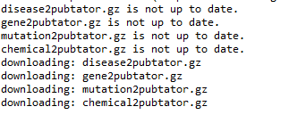

# Updating-Files
This py is an updating tool for specific Pubtator files: disease2pubtator.gz, gene2pubtator.gz, mutation2pubtator.gz, chemical2pubtator.gz. This program allows the user to put in a date, in the format of: Month Date Year (i.e. 12 8 1990), and a path for where the user wants the files downloaded (i.e. \Users\username\Downloads\ ) and it will compare the file with the date specified to the last modified date in pubtator and see if it needs to be updated. If there are spaces in the path make sure the name is wrapped in quotes (\Users\username\Pictures\ "test file"\ )

I've used two different techniques in each connect.py and connect2.py to take into account new tools.
* Connect2.py utilizes the .download tool in ftputil 
* Connect.py uses the .download_if_newer. 

## Connect.py
This py uses the method download_if_newer to compare the downloaded files on the users computer's last_modifed_date with the last_modified_date in pubtator. If it does not exist it will download the file, however, if it does exist it will compare the dates and if the pubtator's date is greater, it will update the file. Since this py is more of a comparison between the files you have now and the files in pubtator, it does not need the verification 

## Connect2.py
This py used the method download. This compares the date the user inputted with the last modified date. If it hasn't been modified it will begin downloading the files into the path the user indicated. To make this work the user must input a date 01/1/0000 and a path to store the files in. This does not check if the file you have currently installed on your computer is up to date.
Results may look like this:

